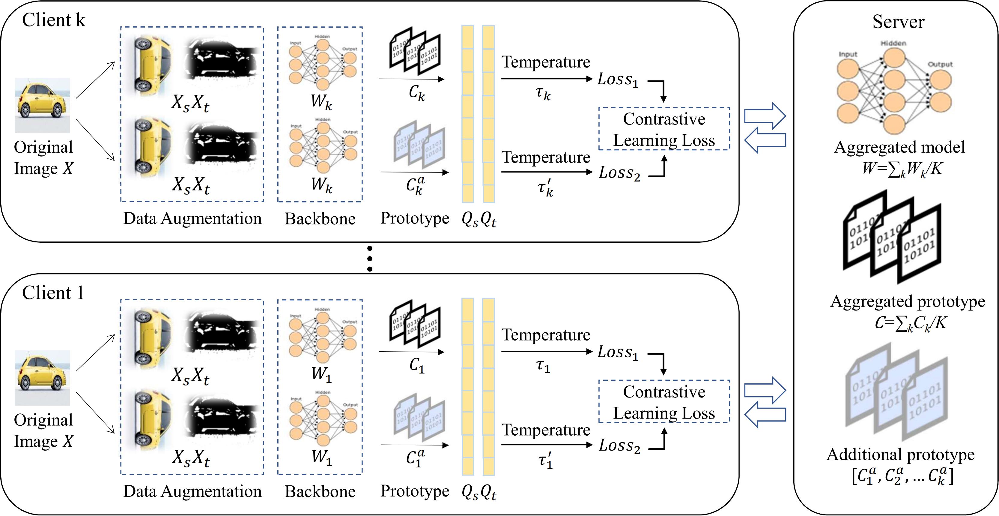

# FedTA
we propose a novel approach FedTA - unsupervised Federated prototype learning approach via
Temperature-Adaption. 
**Prototype Enhancement:** During the local training process, each client can additionally introduce one prototype from other client to simultaneously conduct an extra contrastive learning training. The additional prototype is selected by the similarity between the prototypes from different clients.
**Temperature Adaption:** To facilitate the balanced convergence rate between the local and global prototype in the Non-IID scenario, we propose an adaptive temperature to adjust the local convergence rate by alternatively updating the model parameters and the temperature.

The major contributions of this paper are summarized as follows:
1. We focus on a challenging and practical problem of unsupervised federated learning, where clients need to cooperate to discover the patterns and characteristics of the dataset. Subsequently, we propose contrastive learning methods for this challenge.
2. We empirically find the unstable learning process caused on 
    Non-IID data with popular federated learning algorithms can lead to a notable performance
    degradation of contrastive learning based models. Motivated by this observation, we further propose to
    solve the problem with our FedTA algorithm with prototype enhancement and temperature adaption.
3. We carry out extensive experiments on various datasets and different settings. Experimental results illustrate that our proposed model outperforms the state-of-the-art methods by up to 5.3\% in terms of average accuracy.
# Environment
+ Anaconda
+ python 3.9
+ cuda 11.4
+ torch 1.12.1

Note: If you need to try other python versions and pytorch versions, you can read the Requirement.txt file in detail to meet the needs of different third-party libraries.

To install FedTA, you need to run the following commands.
```bash
conda create -n FedTA python=3.9
conda activate FedTA
git clone https://github.com/boydream123/FedTA.git
pip install -r Requirement.txt
```
# Experiment
We experimented on three benchmark datasets: [MNIST](http://yann.lecun.com/exdb/mnist/), [Fashion MNIST](https://www.kaggle.com/datasets/zalando-research/fashionmnist), and [CIFAR10](https://www.cs.toronto.edu/~kriz/cifar.html). We applied the same data set splitting and model training as in previous work for all of these data sets. Each data set is partitioned into 50 clients.


# Contributing 
If you come across a bug or have an improvement suggestion, please create an issue.
